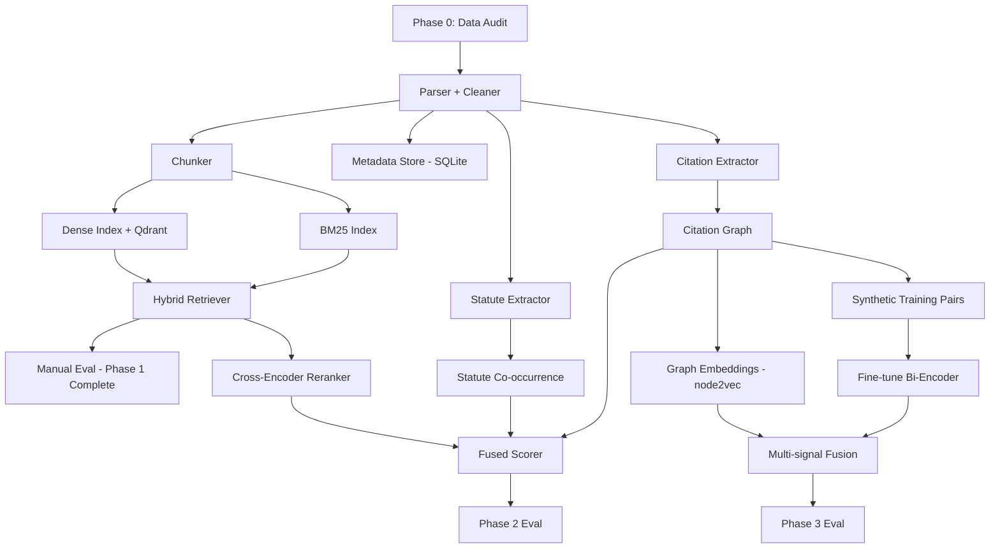

# LexiFusionNet — Architecture & Execution Plan

> **Audience**: Implementer. Every section is actionable. No fluff.

---

## 1. Dataset Reality Check

### 1.1 What Actually Exists

| Property | Value |
|---|---|
| **Source** | IndianKanoon scrapes (Kaggle dataset) |
| **Total files** | 26,688 `.txt` files |
| **Total size** | 860 MB |
| **Year range** | 1950–2025 (76 year-directories) |
| **Avg file size** | 33 KB (~8,000 words) |
| **Min file size** | 216 bytes (effectively empty — just header + page marker) |
| **Max file size** | 2.5 MB (~600K words — multi-part landmark judgments) |
| **Files < 500 bytes** | 8 files (corrupt/empty — metadata only, no judgment body) |
| **Non-ASCII chars** | Near-zero in pre-2000; some Unicode in post-2000 (legal symbols like §, ¶) |

### 1.2 Critical Data Discovery: This is NOT Raw OCR

> [!IMPORTANT]
> **The data is NOT "OCR-heavy unstructured text" as assumed.** These are IndianKanoon web scrapes converted to text via PyMuPDF. The original PDFs were already digital text from IndianKanoon's HTML→PDF rendering. The noise profile is fundamentally different from raw scanned document OCR.

**Actual noise sources:**

| Noise Type | Severity | Example |
|---|---|---|
| **Page markers** | HIGH — breaks every page | `Indian Kanoon - http://indiankanoon.org/doc/XXXXX\n<page_num>` inserted every ~50 lines |
| **Repeated headers** | MEDIUM | Case title repeated at every page break |
| **Inconsistent whitespace** | MEDIUM | Column-formatted citation blocks from old-style judgments (pre-1990) |
| **Missing content** | LOW | 8 files are essentially empty (header-only stubs) |
| **Encoding artifacts** | LOW | Occasional `\u0026` instead of `&` |
| **Actual OCR errors** | NEGLIGIBLE | The text is digitally extracted, not OCR'd |

### 1.3 Structural Signals Actually Present

The files follow a **consistent header format** across all eras:

```
Line 1: <Case Title> vs <Respondent> on <Date>
Line 2: Equivalent citations: <AIR, SCC, SCR numbers>
Line 3: Author: <Judge Name>
Line 4: Bench: <Judge1, Judge2, ...>
```

**Era-dependent structured blocks (pre-2000 only):**

| Block | Present in | Description |
|---|---|---|
| `PETITIONER:` / `RESPONDENT:` | 1950–1995 | Formal party names |
| `CITATION:` | 1950–1995 | Structured citation codes |
| `CITATOR INFO:` | Some pre-1990 | Cross-reference map (`F`, `R`, `D`, `O`, `E`, `RF`, `APL` = Followed, Reversed, Distinguished, Overruled, Explained, Referred, Applied) |
| `HEADNOTE:` | 1950–1999 | Court-authored summary |
| `ACT:` | 1950–1999 | Statutes referenced |
| `JUDGMENT:` | All eras | Body text begins |

**Post-2000 files** have simpler structure: header → formatted court header → judgment body. No HEADNOTE, no CITATOR INFO, no ACT block.

### 1.4 Extractable Signals — Ranked by Reliability

| Signal | Reliability | Extraction Method |
|---|---|---|
| Case title (parties) | ★★★★★ | Line 1 + filename parsing |
| Date of judgment | ★★★★★ | Line 1 + directory year |
| Citation codes (AIR, SCC, SCR) | ★★★★☆ | Regex on "Equivalent citations" line |
| Bench (judge names) | ★★★★☆ | Line 4 parsing |
| Author (writing judge) | ★★★★☆ | Line 3 parsing |
| Statutes/Acts referenced | ★★★☆☆ | Regex `(Section \d+|Article \d+|Act,?\s+\d{4})` within body |
| Case citations within body | ★★★☆☆ | Regex for `\d{4}\s+(AIR|SCC|SCR)\s+\d+` patterns |
| HEADNOTE (summary) | ★★★☆☆ | Only pre-2000, parse between `HEADNOTE:` and `JUDGMENT:` |
| CITATOR INFO (citation type) | ★★☆☆☆ | Only some pre-1990 files |
| Judgment body text | ★★★★☆ | Everything after header, with page markers stripped |

---

## 2. Critical Flaws in Naive Architectures

### Flaw #1: "Just embed the whole document"

- **Problem**: Average document is 33KB (~8K words, ~10K tokens). Embedding models have 512-token context windows (BERT-family) or 8192 tokens (newer models like `jina-embeddings-v3`). A single embedding for a 10K-token document will be lossy and structurally meaningless.
- **Impact**: Two cases about entirely different legal topics but with similar procedural language will appear "similar."
- **Fix**: Chunk-level embeddings with metadata-aware retrieval.

### Flaw #2: "Use LEGAL-BERT / InLegalBERT for everything"

- **Problem**: These are 512-token encoder models. They're good for classification and NER, not for embedding 33KB documents. Also, InLegalBERT was trained on Indian legal text but is still a base BERT — it needs fine-tuning for similarity, and you have **zero labeled pairs**.
- **Impact**: Out-of-the-box embeddings will be mediocre. Fine-tuning requires labeled data you don't have.
- **Fix**: Use a general-purpose retrieval model (e.g., `sentence-transformers/all-MiniLM-L6-v2` or `BAAI/bge-base-en-v1.5`) + BM25 hybrid. Upgrade to legal-specific models **only** if you can generate synthetic training pairs.

### Flaw #3: "Build a citation graph immediately"

- **Problem**: Citation extraction from free text is error-prone. The structured `CITATOR INFO` block exists in only ~30% of files (pre-1990). For the remaining 70%, you need regex extraction from body text, which has ~70-80% precision at best.
- **Impact**: Noisy graph with many false edges will corrupt any graph-based similarity.
- **Fix**: Build the graph incrementally. Start with high-confidence citation links (structured metadata), then extend with regex-extracted citations validated against the corpus.

### Flaw #4: "Neo4j from day one"

- **Problem**: A 26K-node citation graph doesn't need Neo4j. NetworkX handles this in-memory trivially. Neo4j adds Docker complexity, operational overhead, and query latency for zero benefit at this scale.
- **Impact**: Overengineering that slows development.
- **Fix**: Start with NetworkX + GraphML/pickle serialization. Move to Neo4j only if you need persistent multi-user graph queries (Phase 4+).

### Flaw #5: "Remove stopwords and normalize terminology first"

- **Problem**: Legal text has domain-specific stopwords (`herein`, `thereof`, `aforementioned`) that are meaningless for similarity but NOT captured by standard stopword lists. Conversely, words like `shall` vs `may` carry enormous legal weight and must NOT be removed.
- **Impact**: Standard NLP preprocessing destroys legal signal.
- **Fix**: Minimal preprocessing: strip page markers, collapse whitespace, preserve legal terminology. Let the embedding model handle vocabulary importance.

### Flaw #6: "RAG-based Querying Interface in the roadmap"

- **Problem**: RAG requires a generation model (LLM). You have 8GB VRAM on an RTX 2000 Ada. You can run quantized 7B models (Mistral, Llama) at ~4-bit, but inference will be slow (~2-5 tok/s). RAG is a downstream application of the similarity system, not a prerequisite.
- **Impact**: Premature optimization; building RAG before the retrieval system works is pointless.
- **Fix**: Build retrieval first. RAG is Phase 4+ if the retrieval quality justifies it.

---

## 3. Final Recommended Architecture

### 3.1 System Diagram

```
┌─────────────────────────────────────────────────────────────────────┐
│                        LexiFusionNet                                │
│                                                                     │
│  ┌──────────────┐    ┌──────────────┐    ┌───────────────────────┐  │
│  │  DATA LAYER  │───▶│ INDEX LAYER  │───▶│   RETRIEVAL LAYER     │  │
│  └──────────────┘    └──────────────┘    └───────────────────────┘  │
│        │                    │                       │               │
│        ▼                    ▼                       ▼               │
│  ┌──────────┐        ┌──────────┐          ┌──────────────┐        │
│  │ Ingester │        │ BM25     │          │ Hybrid       │        │
│  │ Cleaner  │        │ Index    │          │ Ranker       │        │
│  │ Parser   │        │ (Tantivy)│          │ (BM25+Dense) │        │
│  │ Chunker  │        ├──────────┤          └──────┬───────┘        │
│  └────┬─────┘        │ Dense    │                 │                │
│       │              │ Index    │                 ▼                 │
│       ▼              │ (Qdrant) │          ┌──────────────┐        │
│  ┌──────────┐        ├──────────┤          │ Reranker     │        │
│  │ Metadata │        │ Citation │          │ (Cross-Enc.) │        │
│  │ Store    │        │ Graph    │          └──────────────┘        │
│  │ (SQLite) │        │(NetworkX)│                                  │
│  └──────────┘        └──────────┘                                  │
│                                                                     │
└─────────────────────────────────────────────────────────────────────┘
```

### 3.2 Data Flow

```
Raw .txt files
    │
    ▼
[1] INGEST: Parse header (title, date, citations, bench, author)
    │
    ▼
[2] CLEAN: Strip page markers, repeated headers, collapse whitespace
    │
    ▼
[3] SEGMENT: Identify sections (HEADNOTE, ACT, JUDGMENT body)
    │        Extract statute references, inline case citations
    │
    ▼
[4] CHUNK: Split judgment body into overlapping chunks (512 tokens, 10% overlap)
    │       Attach metadata (case_id, section_type, chunk_index) to each chunk
    │
    ▼
[5] EMBED: Encode chunks using bi-encoder → dense vectors
    │
    ▼
[6] INDEX: Store vectors in Qdrant, lexical index in tantivy/BM25
    │       Store metadata in SQLite, citation edges in NetworkX graph
    │
    ▼
[7] QUERY: Hybrid retrieval (BM25 + dense) → rerank with cross-encoder
           Optional: boost by citation proximity in graph
```

### 3.3 Storage Design

| Store | Technology | Contents | Why |
|---|---|---|---|
| **Metadata** | SQLite | case_id, title, date, year, bench, author, citations, act_refs, file_path | Zero-config, fast, 26K rows is trivial |
| **Vectors** | Qdrant (Docker) | Dense embeddings per chunk, with metadata payload | Self-hosted, fast filtering, HNSW index, REST API |
| **Lexical Index** | `rank_bm25` (Python) | BM25 index over chunks | In-memory, fast, no infrastructure |
| **Citation Graph** | NetworkX + pickle | Nodes=cases, Edges=citations with type labels | In-memory, 26K nodes is tiny for NetworkX |
| **Processed Data** | File system (JSON) | Cleaned/chunked documents as JSON per case | Reproducible, inspectable, version-controllable |

### 3.4 Model Choices

| Component | Model | Why NOT alternatives |
|---|---|---|
| **Bi-Encoder** | `BAAI/bge-base-en-v1.5` (110M params, 768-dim) | Fits in 8GB VRAM easily. Top MTEB performer in its size class. `all-MiniLM-L6-v2` is smaller but lower quality. InLegalBERT isn't trained for retrieval. |
| **Cross-Encoder Reranker** | `cross-encoder/ms-marco-MiniLM-L-6-v2` | Fast, effective reranker. Runs on CPU. No legal-specific reranker exists that's worth the complexity. |
| **Tokenizer for chunking** | `tiktoken` (cl100k_base) | Fast, deterministic token counting. Matches modern model tokenization. |
| **BM25** | `rank_bm25` Python library | Pure Python, no Elasticsearch needed. 26K docs × ~20 chunks = 500K chunks fits in 16GB RAM. |

> [!WARNING]
> **Do NOT use `sentence-transformers/all-mpnet-base-v2`** even though it's popular. It's 420MB and provides marginal improvement over `bge-base` while being slower. At your VRAM budget, every MB matters. `bge-base` is the sweet spot.

---

## 4. Phase-wise Execution Plan

---

### Phase 0: Data Reality & Diagnostics (Days 1–3)

**Objective**: Validate assumptions. Build the data quality report. Create the parsing foundation.

#### Components

1. **Diagnostic script** (`src/diagnostics/data_audit.py`)
   - Count files per year
   - Compute file size distribution (histogram)
   - Detect empty/corrupt files (< 500 bytes)
   - Sample 100 files across eras, extract header fields, measure extraction accuracy
   - Report: `artifacts/data_audit_report.json`

2. **Parser prototype** (`src/data/parser.py`)
   - Parse the 4-line header (title, citations, author, bench)
   - Detect and extract era-specific blocks (HEADNOTE, ACT, CITATOR INFO)
   - Strip IndianKanoon page markers: regex `/^.*Indian Kanoon - http:\/\/indiankanoon\.org\/doc\/\d+\/?\s*\n\d+$/m`
   - Strip repeated case title lines at page breaks
   - Output: structured JSON per case

3. **Quality gate**: Parser must achieve >95% header extraction accuracy on 100-file sample before proceeding.

#### Tools/Libraries
- Python 3.11, `re`, `pathlib`, `json`, `collections.Counter`
- `matplotlib` for distribution plots

#### Data Transformations
```
Raw .txt → {
  "case_id": "<hash of filename>",
  "title": "A.K. Gopalan vs The State Of Madras",
  "date": "1950-05-19",
  "year": 1950,
  "citations": ["1950 AIR 27", "1950 SCR 88"],
  "author": "Hiralal J. Kania",
  "bench": ["Hiralal J. Kania", "Saiyid Fazal Ali", ...],
  "headnote": "..." | null,
  "acts": ["Article 21", "Section 3 of Prevention Detention Act"] | [],
  "body": "<cleaned judgment text>",
  "file_path": "data/input/supreme_court_judgments_txt/1950/..."
}
```

#### Failure Points
- Header format may vary in edge cases (multi-line titles, missing author)
- Pre-1950 formatting conventions unknown (but we only have 1950+)
- Some files have garbled column formatting in HEADNOTE sections

#### Metrics for Success
- Header extraction: >95% accuracy on title, date, bench
- Citation extraction: >90% accuracy on "Equivalent citations" line
- Body text extraction: Page markers removed with <1% false positives
- Corrupt file detection: All 8 known empty files flagged

#### What NOT to Do
- Do NOT attempt NER or entity extraction yet
- Do NOT install spaCy, transformers, or any ML library
- Do NOT try to "fix" OCR errors — they're negligible

---

### Phase 1: Minimum Viable Similarity System (Days 4–14)

**Objective**: Produce a working system that takes a case ID and returns the top-N most similar cases. Must work end-to-end even if quality is imperfect.

#### Components

1. **Chunker** (`src/data/chunker.py`)
   - Split cleaned body text into chunks of ~400 tokens with 40-token overlap
   - Attach metadata: `{case_id, chunk_index, total_chunks, section_hint}`
   - `section_hint` = "headnote" | "body" | "conclusion" (heuristic based on position)

2. **BM25 Index** (`src/index/bm25_index.py`)
   - Build BM25 index over all chunks
   - Serialize index to disk (pickle)
   - Query: given a case_id, retrieve its chunks, query BM25, aggregate scores at case level

3. **Dense Embedding** (`src/index/dense_index.py`)
   - Batch-encode all chunks using `bge-base-en-v1.5`
   - Estimated: 26K cases × 20 chunks avg = ~530K chunks
   - At 768-dim float32: ~530K × 768 × 4 bytes = ~1.6 GB — fits in VRAM for inference
   - Store in Qdrant (Docker container)

4. **Hybrid Retriever** (`src/retrieval/hybrid.py`)
   - For a query case: retrieve top 100 from BM25 + top 100 from dense
   - Fuse scores using Reciprocal Rank Fusion (RRF)
   - Return top-20 candidate cases

5. **Metadata Store** (`src/data/metadata_store.py`)
   - SQLite database with parsed metadata per case
   - Enables filtering: "similar cases from same decade" or "same bench"

6. **Evaluation harness** (`src/eval/manual_eval.py`)
   - Input: 10 manually selected query cases spanning different legal areas
   - Output: Top-10 results per query, displayed with metadata
   - Human (you) inspects and annotates quality

#### Tools/Libraries
- `sentence-transformers`, `torch` (CUDA), `qdrant-client`
- `rank_bm25`, `tiktoken`
- `sqlite3` (stdlib)

#### Failure Points
- **Chunking boundary issues**: Legal arguments span multiple paragraphs; chunk boundaries may split reasoning mid-sentence → mitigated by 10% overlap
- **BM25 vocabulary mismatch**: Old judgments (1950s) use archaic legal English (e.g., "petitioner hath") → BM25 handles this better than dense models
- **Embedding quality**: `bge-base` is general-purpose, may not capture legal semantics like "distinguished" vs "followed" → acceptable for Phase 1, improved in Phase 3
- **Qdrant memory**: 530K × 768-dim vectors @ float32 = ~1.6GB RAM for Qdrant → fits within 16GB system RAM

#### Metrics for Success
- **Coverage**: All 26,688 cases indexed (minus corrupt files)
- **Latency**: Query → results in <5 seconds
- **Qualitative**: On 10 test queries, at least 6/10 should have >50% relevant results in top-10 (judged by you based on legal topic, cited statutes, and parties)

#### What NOT to Do
- Do NOT add a web UI yet
- Do NOT implement reranking yet (that's Phase 2)
- Do NOT fine-tune any model
- Do NOT use LangChain or any framework — raw Python + libraries only

---

### Phase 2: Structural Intelligence (Days 15–28)

**Objective**: Add legal structure as a retrieval signal — citation networks, statute co-occurrence, and cross-encoder reranking.

#### Components

1. **Citation Extractor** (`src/extraction/citation_extractor.py`)
   - **Tier 1 (high confidence)**: Parse `CITATOR INFO` blocks where available (~30% of files)
     - Extract citation type: F(ollowed), R(eversed), D(istinguished), O(verruled), E(xplained), RF(erred), APL(ied)
   - **Tier 2 (medium confidence)**: Regex extraction of citation patterns from body text
     - Patterns: `\d{4}\s+(AIR|SCC|SCR)\s+\d+`, `(\d{4})\s+\d+\s+SCC\s+\d+`
     - Match extracted citations against known citation codes in metadata store
   - **Tier 3 (low confidence)**: Case name matching in body text
     - Match `<Party1> vs <Party2>` patterns against case title index

2. **Citation Graph** (`src/graph/citation_graph.py`)
   - Build directed graph: `case_A --[cites]--> case_B`
   - Edge attributes: `{type: "followed"|"distinguished"|..., confidence: "tier1"|"tier2"|"tier3"}`
   - Compute graph metrics per node: in-degree (how often cited), PageRank, betweenness centrality
   - Serialize as GraphML + pickle

3. **Statute Co-occurrence Matrix** (`src/extraction/statute_extractor.py`)
   - For each case, extract referenced statutes/acts and article/section numbers
   - Build case-statute bipartite graph
   - Cases sharing many statutes → higher structural similarity
   - Store as sparse matrix (scipy.sparse)

4. **Cross-Encoder Reranker** (`src/retrieval/reranker.py`)
   - Take top-20 from Phase 1 hybrid retriever
   - Rerank using `cross-encoder/ms-marco-MiniLM-L-6-v2`
   - Input: (query_case_headnote_or_first_chunk, candidate_case_headnote_or_first_chunk)
   - Output: Re-scored top-10

5. **Fused Scorer** (`src/retrieval/fused_scorer.py`)
   - Combine signals with weighted sum:
     - `score = α × hybrid_rrf_score + β × citation_proximity + γ × statute_overlap + δ × reranker_score`
   - Initial weights: α=0.3, β=0.2, γ=0.1, δ=0.4
   - Tune manually on eval set

#### Tools/Libraries
- `networkx`, `scipy.sparse`
- `cross-encoder` from `sentence-transformers`

#### Failure Points
- **Citation matching**: Regex will miss non-standard citation formats and produce false matches → mitigated by matching against known citation DB built from header parsing
- **Statute extraction noise**: "Section 125" might be CrPC or CPC depending on context → accept ambiguity in Phase 2, resolve in Phase 3 with context
- **Reranker latency**: Cross-encoder on 20 pairs per query is ~200ms on CPU → acceptable

#### Metrics for Success
- **Citation graph**: >10,000 edges extracted (minimum), >3,000 from Tier 1
- **Reranker lift**: Measurable improvement in top-5 relevance on 10-query eval set compared to Phase 1
- **Statute coverage**: Acts referenced extracted from >60% of cases

#### What NOT to Do
- Do NOT use Neo4j
- Do NOT implement graph neural networks yet
- Do NOT try to classify citation types for Tier 2/3 citations — just mark them as "cites"
- Do NOT build a knowledge graph ontology

---

### Phase 3: Advanced Modeling (Days 29–45)

**Objective**: Improve embedding quality and add graph-based similarity signals.

#### Components

1. **Synthetic Training Data Generation** (`src/training/synthetic_pairs.py`)
   - Use citation graph to generate training pairs:
     - **Positive pairs**: Cases that cite each other (especially "followed" type)
     - **Hard negatives**: Cases from same year/statute but no citation link
   - Target: ~50K training pairs
   - Use this to fine-tune the bi-encoder (or train an adapter)

2. **Fine-tuned Bi-Encoder** (`src/models/finetuned_encoder.py`)
   - Start from `bge-base-en-v1.5`
   - Fine-tune using contrastive loss (MultipleNegativesRankingLoss) on synthetic pairs
   - Train on GPU: small batches (8-16), ~5 epochs
   - Evaluate on held-out pairs

3. **Graph Embeddings** (`src/graph/graph_embeddings.py`)
   - Run node2vec on citation graph → 128-dim embeddings per case
   - Use `node2vec` from `graspologic` or `networkx` + `gensim`
   - These embeddings capture "structural role" — cases in similar positions in the citation network

4. **Multi-signal Fusion** (`src/retrieval/multi_signal.py`)
   - Combine: dense (fine-tuned), BM25, graph embedding similarity, statute overlap, citation proximity
   - Learn weights via grid search on eval set or simple logistic regression

#### Tools/Libraries
- `sentence-transformers` (training), `gensim` (node2vec), `graspologic`
- `scikit-learn` (weight learning)

#### Failure Points
- **Synthetic pair quality**: If citation graph is noisy, training pairs will be noisy → garbage-in-garbage-out. Validate pair quality before training.
- **Overfitting**: 50K pairs from 26K cases — risk of data leakage. Strict train/test split by case_id required.
- **VRAM during training**: Fine-tuning bge-base needs ~4-6GB VRAM. Tight on 8GB with batch size 16 → use gradient accumulation if needed.

#### Metrics for Success
- **Fine-tuned model**: >5% improvement in retrieval quality (measured by human eval or nDCG if labeled pairs available)
- **Graph embeddings**: Cluster visualization shows meaningful groupings by legal domain
- **Fusion**: Combined scorer outperforms any single signal on eval set

#### What NOT to Do
- Do NOT use GNNs (GraphSAGE, GAT) — overkill for 26K nodes, and you lack node feature labels
- Do NOT fine-tune on all data — hold out 20% for evaluation
- Do NOT experiment with more than 3 model variants — pick one and optimize

---

### Phase 4: Research-Level Enhancements (Days 46+, only if justified)

**Objective**: Explore advanced features. Only pursue if Phase 3 shows strong baselines.

#### Candidate Features (pursue MAX 2)

| Feature | Feasibility | Expected Impact | Verdict |
|---|---|---|---|
| **Temporal decay** | ✅ Easy | LOW — recent cases aren't inherently more similar | Skip unless domain expert disagrees |
| **Rhetorical role segmentation** | ⚠️ Hard | HIGH if works — separate "facts" from "reasoning" for targeted matching | Pursue IF time allows. Use `LegalSeg` models from HuggingFace |
| **LLM-based summarization** | ⚠️ Slow | MEDIUM — compress cases for better embedding | Only with API-based LLM (Gemini, GPT-4o). Local 7B too slow |
| **Sentiment/stance edges** | ❌ Hard, low signal | LOW — sentiment in legal text is heavily formulaic | Skip |
| **Knowledge graph (NyOn ontology)** | ❌ Massive effort | HIGH in theory, but requires entity linking you don't have ground truth for | Skip |
| **Multi-modal** | ❌ Irrelevant | N/A — text only | Skip |

#### Recommended Phase 4 Items
1. **Rhetorical role segmentation** — if a pre-trained model exists for Indian judgments
2. **RAG interface** — once retrieval quality is validated, add a Gradio/Streamlit UI with optional LLM generation

---

## 5. Engineering Plan

### 5.1 Folder Structure

```
LexiFusionNet/
├── configs/
│   └── config.yaml              # All hyperparameters, paths, model names
├── data/
│   ├── input/
│   │   └── supreme_court_judgments_txt/   # Raw data (gitignored)
│   └── processed/
│       ├── parsed/                # JSON per case (cleaned + structured)
│       ├── chunks/                # JSON per case (chunked)
│       └── metadata.db            # SQLite database
├── artifacts/
│   ├── data_audit_report.json     # Phase 0 output
│   ├── citation_graph.graphml     # Phase 2 output
│   ├── eval_results/              # Evaluation outputs
│   └── models/                    # Saved fine-tuned models (gitignored)
├── src/
│   ├── __init__.py
│   ├── config.py                  # Config loader (YAML → dataclass)
│   ├── diagnostics/
│   │   └── data_audit.py          # Phase 0 diagnostic script
│   ├── data/
│   │   ├── __init__.py
│   │   ├── parser.py              # Raw text → structured JSON
│   │   ├── cleaner.py             # Page marker removal, whitespace normalization
│   │   ├── chunker.py             # Document → overlapping chunks
│   │   └── metadata_store.py      # SQLite CRUD
│   ├── extraction/
│   │   ├── __init__.py
│   │   ├── citation_extractor.py  # Extract case citations
│   │   └── statute_extractor.py   # Extract statute/act references
│   ├── index/
│   │   ├── __init__.py
│   │   ├── bm25_index.py          # Build and query BM25 index
│   │   └── dense_index.py         # Qdrant vector index management
│   ├── graph/
│   │   ├── __init__.py
│   │   ├── citation_graph.py      # Build/query citation graph
│   │   └── graph_embeddings.py    # node2vec embeddings
│   ├── retrieval/
│   │   ├── __init__.py
│   │   ├── hybrid.py              # BM25 + Dense fusion
│   │   ├── reranker.py            # Cross-encoder reranking
│   │   └── fused_scorer.py        # Multi-signal fusion
│   ├── training/
│   │   ├── __init__.py
│   │   └── synthetic_pairs.py     # Generate training data from graph
│   ├── models/
│   │   ├── __init__.py
│   │   └── finetuned_encoder.py   # Fine-tuning pipeline
│   └── eval/
│       ├── __init__.py
│       └── manual_eval.py         # Evaluation harness
├── scripts/
│   ├── run_phase0.py              # Orchestrator for Phase 0
│   ├── run_phase1.py              # Orchestrator for Phase 1
│   ├── run_phase2.py              # Orchestrator for Phase 2
│   └── run_phase3.py              # Orchestrator for Phase 3
├── tests/
│   ├── test_parser.py
│   ├── test_chunker.py
│   ├── test_citation_extractor.py
│   └── test_retrieval.py
├── docker-compose.yml
├── Dockerfile
├── requirements.txt
├── pyproject.toml
└── README.md
```

### 5.2 Docker Service Breakdown

```yaml
# docker-compose.yml
version: '3.8'

services:
  app:
    build: .
    volumes:
      - .:/app
      - ./data:/app/data
    ports:
      - "8000:8000"
    environment:
      - PYTHONUNBUFFERED=1
      - CUDA_VISIBLE_DEVICES=0
    deploy:
      resources:
        reservations:
          devices:
            - driver: nvidia
              count: 1
              capabilities: [gpu]
    depends_on:
      - qdrant

  qdrant:
    image: qdrant/qdrant:latest
    ports:
      - "6333:6333"    # REST API
      - "6334:6334"    # gRPC
    volumes:
      - qdrant_data:/qdrant/storage
    environment:
      - QDRANT__STORAGE__STORAGE_PATH=/qdrant/storage

volumes:
  qdrant_data:
```

**Services:**
| Service | Purpose | When Needed |
|---|---|---|
| `app` | Main Python application (all pipelines) | Always |
| `qdrant` | Vector database for dense embeddings | Phase 1+ |

**NOT included (and why):**
- ~~Neo4j~~ — NetworkX is sufficient for 26K nodes
- ~~Elasticsearch~~ — `rank_bm25` Python library is sufficient
- ~~Redis~~ — No caching layer needed at this scale
- ~~Nginx~~ — No web serving needed until Phase 4

### 5.3 Dockerfile

```dockerfile
FROM python:3.11-slim

# System dependencies
RUN apt-get update && apt-get install -y --no-install-recommends \
    build-essential \
    && rm -rf /var/lib/apt/lists/*

WORKDIR /app

# Install Python dependencies
COPY requirements.txt .
RUN pip install --no-cache-dir -r requirements.txt

COPY . .

# Default: run the main pipeline
CMD ["python", "-m", "scripts.run_phase1"]
```

### 5.4 Requirements (Phased)

```
# requirements.txt — Phase 0
pyyaml>=6.0
matplotlib>=3.8

# Phase 1
sentence-transformers>=2.7
torch>=2.2
qdrant-client>=1.9
rank-bm25>=0.2.2
tiktoken>=0.7

# Phase 2
networkx>=3.2
scipy>=1.12

# Phase 3
gensim>=4.3
scikit-learn>=1.4

# Testing
pytest>=8.0
```

### 5.5 Implementation Order & Dependencies



---

## 6. Risks & Failure Modes

### Critical Risks

| Risk | Probability | Impact | Mitigation |
|---|---|---|---|
| **BM25 dominates dense retrieval** | HIGH | Dense embeddings add no value over lexical matching | This is actually fine for Phase 1 — it means the baseline works. Dense becomes useful for semantic similarity across eras and varying legal language. Measure both. |
| **Citation extraction is too noisy** | MEDIUM | Graph-based signals corrupt fusionscoring | Use tiered confidence. Only Tier 1 (structured CITATOR INFO) for graph-based similarity in Phase 2. Add Tier 2 cautiously. |
| **530K chunks overwhelm RAM** | LOW | BM25 index too large for 16GB | BM25 is sparse — 500K documents with vocab ~200K ≈ 400MB. Safe margin. |
| **Qdrant OOM on 530K 768-dim vectors** | LOW | ~1.6GB for vectors + HNSW index overhead (~2x) ≈ 3.2GB | Start Qdrant with `--memory-limit 4g`. Monitor with `docker stats`. |
| **Fine-tuning degrades general quality** | MEDIUM | Model overfits to citation-derived pairs | Use validation set. Early stopping. Compare fine-tuned vs base model on all queries. |
| **No ground truth for evaluation** | HIGH | Cannot compute automated metrics | Phase 1-2 rely on manual human eval. In Phase 3, use citation graph as a **proxy**: cases that cite each other should rank highly. This is a noisy but usable proxy metric. |

### Non-Obvious Failure Modes

1. **Duplicate documents**: Same case may appear under slightly different filenames (e.g., different page splits). This will inflate similarity scores. → Run deduplication (hash of first 500 chars of body) in Phase 0.

2. **Mega-files dominate**: Cases with 2.5MB of text produce 200+ chunks, dominating dense retrieval frequency. → Cap chunks per case at 50 (covers ~20K tokens ≈ first 90% of most judgments).

3. **Long tail of tiny files**: 8 files with <500 bytes are stubs. If indexed, they'll match everything poorly. → Filter out files with body text < 100 words.

4. **Year directories not matching judgment dates**: Some judgments may have been decided in one year but filed/uploaded in another. Trust the date in the text, not the directory. → Parser already extracts date from text.

---

## 7. What to Build Immediately (First 7 Days)

### Day 1: Project Setup + Config

- [ ] Restructure repo to match Section 5.1 folder structure
- [ ] Create `configs/config.yaml` with all paths and parameters
- [ ] Create `src/config.py` (YAML → Python dataclass)
- [ ] Update `requirements.txt` (Phase 0 deps only)
- [ ] Update `docker-compose.yml` per Section 5.2
- [ ] Update `Dockerfile` per Section 5.3
- [ ] Create `pyproject.toml` for package structure
- [ ] Commit: "feat: restructure repo for phased implementation"

### Day 2: Phase 0 — Data Audit

- [ ] Implement `src/diagnostics/data_audit.py`
  - File count, size distribution, empty file detection
  - Sample 100 files, attempt header parsing, report accuracy
  - Detect duplicates (body text hash)
- [ ] Generate `artifacts/data_audit_report.json`
- [ ] Commit: "feat: phase 0 data audit complete"

### Day 3: Parser + Cleaner

- [ ] Implement `src/data/cleaner.py`
  - Strip IndianKanoon page markers
  - Remove repeated case title lines
  - Collapse excess whitespace
- [ ] Implement `src/data/parser.py`
  - Extract: title, date, citations, author, bench
  - Extract: headnote (pre-2000), body text
  - Output: JSON per case
- [ ] Write `tests/test_parser.py` — test against 10 known files from different eras
- [ ] Commit: "feat: parser and cleaner for raw text processing"

### Day 4: Run Full Parse + Metadata Store

- [ ] Run parser on all 26,688 files
- [ ] Implement `src/data/metadata_store.py` (SQLite)
- [ ] Load all parsed metadata into SQLite
- [ ] Verify: query SQLite for random cases, check fields
- [ ] Commit: "feat: full corpus parsed, metadata store populated"

### Day 5: Chunker + BM25 Index

- [ ] Implement `src/data/chunker.py` (400-token chunks, 40-token overlap)
- [ ] Run chunking on all cases → `data/processed/chunks/`
- [ ] Implement `src/index/bm25_index.py`
- [ ] Build BM25 index, serialize to disk
- [ ] Test: query 3 cases, check top-10 results for sanity
- [ ] Commit: "feat: chunking and BM25 index"

### Day 6: Dense Embeddings + Qdrant

- [ ] Start Qdrant via docker-compose
- [ ] Implement `src/index/dense_index.py`
- [ ] Batch-encode all chunks with `bge-base-en-v1.5` (GPU)
  - Estimated time: 530K chunks × 512 tokens ÷ batch_size_128 ≈ ~4,100 batches ≈ 2-3 hours on RTX 2000
- [ ] Upload vectors to Qdrant
- [ ] Test: query 3 cases via dense retrieval
- [ ] Commit: "feat: dense embeddings in Qdrant"

### Day 7: Hybrid Retriever + First Eval

- [ ] Implement `src/retrieval/hybrid.py` (RRF fusion of BM25 + Dense)
- [ ] Implement `src/eval/manual_eval.py`
- [ ] Select 10 test cases spanning different legal domains:
  - Constitutional law, Criminal (IPC/CrPC), Tax, Property, Labor, Family, Environmental, Contract, IP, Administrative
- [ ] Run evaluation, record results
- [ ] Commit: "feat: hybrid retrieval with initial evaluation — Phase 1 baseline"

---

> [!NOTE]
> **After Day 7**: You will have a working end-to-end system. The quality may not be perfect, but you'll have real retrieval results to analyze. Everything after this point is iterative improvement, not architecture changes.
