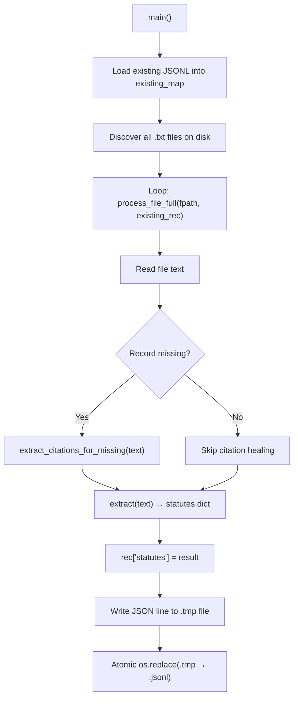
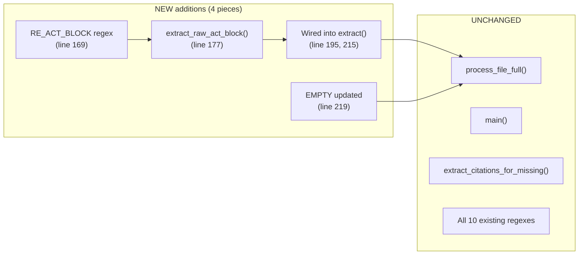

# `raw_act_block` Addition — Detailed Walkthrough

## 1. How the Previous Version Worked

### Data Flow (before this change)



### The `extract(text)` function (before)

This was the core statutory extraction engine. It ran **10 regex families** over the **full document text** and returned a dict with 10 list-valued keys:

```python
def extract(text):
    return {
        'ipc_sections':        [...],   # IPC section matches
        'bns_sections':        [...],   # BNS section matches
        'crpc_sections':       [...],   # CrPC section matches
        'bnss_sections':       [...],   # BNSS section matches
        'cpc_sections':        [...],   # CPC section matches
        'constitutional_refs': [...],   # Article X of Constitution
        'order_rules':         [...],   # Order X Rule Y
        'named_act_sections':  [...],   # "Section X of the Y Act, 1234"
        'rw_combinations':     [...],   # "Section X read with Section Y"
        'bare_section_lists':  [...],   # "Sections 302, 304, 307"
    }
```

Each key used `find_all(pattern, text)` which:
1. Runs `pattern.finditer(text)` — scans the **entire** document
2. Calls `clean()` on each match — collapses whitespace
3. Calls `dedup()` — removes case-insensitive duplicates

### The `EMPTY` sentinel dict (before)

```python
EMPTY = {k: [] for k in ['ipc_sections', 'bns_sections', ...]}
```

This served **two purposes**:
1. **Error fallback** — If a file can't be read, `rec['statutes'] = {k: [] for k in EMPTY.keys()}` gives a valid empty skeleton
2. **Cleanup** — On line 275, `for k in EMPTY.keys(): rec.pop(k, None)` removes any old flat-level keys from a previous run's schema

### The `process_file_full()` function (before)

This is the per-file orchestrator:

| Step | What it does |
|------|-------------|
| 1. Build base record | Uses `existing_rec` if found in JSONL, else creates fresh `{file_id, year, self_citations: [], ...}` |
| 2. Remove deprecated keys | Pops old `ipc_mentions`, `act_mentions`, and any flat statute keys from earlier schema |
| 3. Read file text | `fpath.read_text(...)`, on failure writes empty `statutes` and returns early |
| 4. Heal citations (if new) | Only if record was missing from JSONL — builds `self_citations`, `cited_cases`, `case_names` from the header |
| 5. Extract statutes | `rec['statutes'] = extract(text)` — nests the 10-key dict under `statutes` |
| 6. Return | `(rec, elapsed_ms)` |

### The `main()` function

- Loads the existing `citations_network.jsonl` into a `{file_id: record}` map
- Discovers all `.txt` files under the Supreme Court judgments directory
- Loops over each file, calling `process_file_full()`
- Writes each JSON record to a **temp file** (`.tmp`)
- **Atomically replaces** the `.tmp` → `.jsonl` (safe against crashes)
- Prints a progress bar every 100 files

### The Problem

The 10 regex families only extract **structured mentions** like:
> "Section 302 of IPC", "Article 21 of the Constitution"

But many older Indian Kanoon judgments have a structured `ACT:` metadata header near the top of the file that looks like:

```
ACT:
Constitution of India, Art. 32--Special Tribunals Regulation (Hyderabad), ss. 2, 7
Indian Kanoon - http://indiankanoon.org/doc/12345/
```

This header contains **valuable statute references** that the 10 regexes completely miss because:
- They're formatted differently (comma-separated, abbreviated)
- They use `--` delimiters, `ss.` abbreviations, etc.
- They appear only in the metadata block, not in the body text prose

**Result:** ~18% of files produce near-empty statute outputs even though the `ACT:` block has real data.

---

## 2. How the New Version Works

### What was added

Four surgical changes, each marked with its location:

#### Change A — New regex `RE_ACT_BLOCK` (line 169–172)

```python
RE_ACT_BLOCK = re.compile(
    r'\bACT:\s*(.*?)\s*Indian\s+Kanoon\s*-\s*http://indiankanoon\.org',
    re.I | re.S)
```

| Part | Meaning |
|------|---------|
| `\bACT:` | Matches the literal word `ACT:` at a word boundary |
| `\s*` | Optional whitespace/newlines after the colon |
| `(.*?)` | **Lazy capture** — grabs everything between `ACT:` and the terminator (group 1) |
| `\s*Indian\s+Kanoon\s*-\s*http://indiankanoon\.org` | The terminator — the Indian Kanoon footer line |
| `re.I` | Case-insensitive |
| `re.S` | Dotall mode — `.` matches newlines too (the ACT block can span multiple lines) |

> [!IMPORTANT]
> This regex is only ever applied to `text[:4000]` (see below), NOT the full document. The `.*?` lazy quantifier is safe here because the search space is bounded to 4KB max.

#### Change B — New helper `extract_raw_act_block(text)` (line 177–192)

```python
def extract_raw_act_block(text):
    head = text[:4000]              # ① Slice only the document head

    m = RE_ACT_BLOCK.search(head)   # ② Search within the 4KB window
    if not m:
        return ""                   # ③ No ACT: block → empty string

    block = clean(m.group(1))       # ④ Collapse whitespace via clean()
    block = re.sub(r'\s+', ' ', block)  # ⑤ Extra cleanup for page artifacts
    return block.strip()            # ⑥ Final trim
```

**Why `text[:4000]`?** The `ACT:` header consistently appears in the first ~2–3K characters. Slicing to 4000 gives a safety margin while keeping the regex search fast (avoids scanning 100KB+ judgment bodies).

**Why the double-clean?** The `clean()` function collapses internal whitespace via `' '.join(s.split())`, but the captured group might contain embedded newlines, form-feeds, or other page artifacts from OCR'd documents. The extra `re.sub(r'\s+', ' ', block)` ensures those are normalized too.

#### Change C — Wiring into `extract(text)` (line 195–196, 215)

```python
def extract(text):
    raw_act_block = extract_raw_act_block(text)   # ← NEW: runs before the regex scan

    return {
        'ipc_sections':        ...,
        ...
        'bare_section_lists':  ...,
        'raw_act_block':       raw_act_block,      # ← NEW: appended to the dict
    }
```

The `raw_act_block` is a **string**, not a list — this is intentional. There's only one `ACT:` header per document, and we're preserving it raw (no semantic parsing yet).

#### Change D — Updated `EMPTY` dict (line 219–222)

```python
_LIST_KEYS = ['ipc_sections', 'bns_sections', ...]
EMPTY = {k: [] for k in _LIST_KEYS}
EMPTY['raw_act_block'] = ''      # ← String default, not a list
```

**Why `_LIST_KEYS`?** Separating the list-type keys from the string-type key avoids polluting the comprehension. `EMPTY` now correctly produces `{'ipc_sections': [], ..., 'raw_act_block': ''}`.

---

## 3. Effects on the Rest of the Code

### What's affected

| Location | Effect | Safe? |
|----------|--------|-------|
| [extract()](file:///home/vxrun/LexiFusionNet/experiments/phase1/statutory_extraction/extract_all_statutes.py#L195) | Now returns an 11-key dict (was 10). The new key is `raw_act_block: str` | ✅ Yes — additive only |
| [process_file_full()](file:///home/vxrun/LexiFusionNet/experiments/phase1/statutory_extraction/extract_all_statutes.py#L302) line `rec['statutes'] = extract(text)` | Receives the 11-key dict and stores it under `statutes`. **No code change needed here** — it stores whatever `extract()` returns | ✅ Transparent |
| [Error path](file:///home/vxrun/LexiFusionNet/experiments/phase1/statutory_extraction/extract_all_statutes.py#L308) `rec['statutes'] = {k: [] for k in EMPTY.keys()}` | `EMPTY.keys()` now includes `raw_act_block`, so the error fallback produces `'raw_act_block': []` instead of `''` | ⚠️ See below |
| [Cleanup loop](file:///home/vxrun/LexiFusionNet/experiments/phase1/statutory_extraction/extract_all_statutes.py#L298) `for k in EMPTY.keys(): rec.pop(k, None)` | Now also pops `raw_act_block` from root level if it existed — harmless since this key never existed at root before | ✅ No-op |
| [main()](file:///home/vxrun/LexiFusionNet/experiments/phase1/statutory_extraction/extract_all_statutes.py#L328) | No changes. `json.dumps(rec)` serializes whatever's in the dict | ✅ Transparent |
| **Output JSONL** | Each record's `statutes` object now has 11 keys instead of 10 | ✅ Additive |
| **Downstream consumers** | Any code reading `rec['statutes']` will see the new key. Code iterating over `statutes.values()` expecting only lists will now encounter a string | ⚠️ See below |

### The error-path type mismatch

> [!WARNING]
> On line 308, the error fallback uses `{k: [] for k in EMPTY.keys()}`, which creates `'raw_act_block': []` (a list) instead of `''` (a string). This only triggers when a file **can't be read at all** (file permission error, corrupt file, etc.), which is extremely rare. However, if you want strict type consistency:

This is a minor inconsistency. The error path on line 308 does `{k: [] for k in EMPTY.keys()}` — it creates **all values as lists**, including `raw_act_block`. In normal operation this never matters because files that can't be read are extremely rare. But if you want to fix it for correctness, the line would change to:

```python
rec['statutes'] = dict(EMPTY)  # Uses EMPTY directly which has '' for raw_act_block
```

Let me know if you'd like me to apply that one-line fix.

### What is NOT affected

| Component | Why it's safe |
|-----------|---------------|
| Citation extraction (`extract_citations_for_missing`) | Completely separate function, doesn't touch `statutes` |
| Auto-healing logic | Operates on `self_citations`, `cited_cases`, `case_names` — unrelated keys |
| Atomic write strategy | Writes whatever `json.dumps(rec)` produces — schema-agnostic |
| Existing 10 regex extractions | Untouched — same patterns, same `find_all()` calls |
| Progress bar / timing | Measures `process_file_full()` wall time — the new extraction adds negligible overhead (4KB slice + single regex) |

### Performance impact

The new `extract_raw_act_block()` adds **one regex search over a 4KB string** per file. For context:
- The existing 10 regex families each scan the **full document** (typically 50–200KB)
- A 4KB regex search is ~0.01ms — invisible in the pipeline

**Net impact: effectively zero.**

---

## 4. Summary of All Changes



| What | Before | After |
|------|--------|-------|
| `extract()` return keys | 10 (all lists) | 11 (10 lists + 1 string) |
| `EMPTY` keys | 10 | 11 |
| `statutes` in output JSONL | 10 fields | 11 fields |
| `raw_act_block` value | didn't exist | `""` or `"Constitution of India, Art. 32--..."` |
| Semantic parsing of ACT block | N/A | Not attempted (raw preservation only) |
