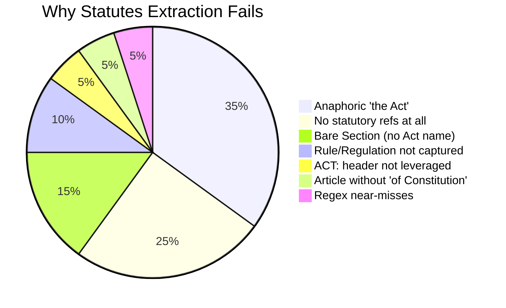

# Empty Statutes Diagnosis — Root Cause Analysis

> [!IMPORTANT]
> **~4,700 files** (out of ~26,600) return completely empty statutes — that's roughly **17-18% failure rate**.

---

## 1. Sampled Files & What They Reveal

I read 4 actual `.txt` files from the empty list across different years/case types:

### File 1: `Gokal vs State Of Haryana (1991)` — 3,481 bytes
- **Case Type**: Land acquisition compensation
- **Legal refs found**: `"Section 4 notifications"` — refers to Land Acquisition Act but **never names it**
- **Why extraction failed**: "Section 4" appears in prose context ("the relevant dates of the Section 4 notifications") — no `"of [Act Name]"` follows
- **Category**: `BARE_SECTION_NO_ACT_NAME`

### File 2: `Ram Kishan vs Tarun Bajaj (2014)` — 12,838 bytes
- **Case Type**: Contempt proceedings
- **Legal refs found**: Names `"Contempt of Courts Act, 1971"` once, then says `"hereinafter referred to as 'the Act'"` and uses `"under the Act"` / `"the provisions of the Act"` throughout
- **Also references**: `"West Bengal Land Reforms Act, 1955"` (but with no Section number)
- **Why extraction failed**: The **anaphoric "the Act" pattern** — Act is named once, then always referred to as "the Act"
- **Category**: `ANAPHORIC_THE_ACT`

### File 3: `M/S Isnar Aqua Farms vs United India Insurance (2023)` — 18,533 bytes
- **Case Type**: Insurance dispute (prawn cultivation)
- **Legal refs found**: **ZERO statutory sections**. Entire judgment is about insurance policy interpretation, quantum of damages, and interest rates
- **Why extraction failed**: **No statutes referenced at all** — purely about contract/policy interpretation
- **Category**: `NO_STATUTORY_REFS`

### File 4: `Vemareddy Kumaraswamy Reddy vs State of A.P (2006)` — 15,417 bytes
- **Case Type**: Land reform ceiling — cashew tree compensation
- **Legal refs found**:
  - `"Section 15 of the Act"` — "the Act" = AP Land Reforms Act, 1973
  - `"Rule 11 of the Rules"` — "Rules" = AP Land Reforms Rules, 1974
  - `"Section 26 of the A.P. Forest Act, 1882"` ← **This SHOULD have been caught!**
  - `"Rule 5 of the Rules"` — again anaphoric
- **Why extraction failed**: Mix of anaphoric refs + **"Rule" not captured** + one actual `"Section X of the [Act]"` that the regex missed (parentheses in act name)
- **Category**: `ANAPHORIC_THE_ACT` + `RULE_NOT_CAPTURED` + `REGEX_NEAR_MISS`

---

## 2. The 7 Root Causes (Priority Ranked)



### 🔴 Cause 1: Anaphoric "the Act" References (~35% of failures)

**The #1 killer.** Indian judgments routinely do this:

```
...the Contempt of Courts Act, 1971 (hereinafter referred to as 'the Act')...
...Section 12 of the Act provides that...
...under the provisions of the Act...
```

Your regex `RE_NAMED_ACT` requires: `Section X of [A-Z]\w+ Act` — but `"the Act"` starts with lowercase `"the"` and has no named words before "Act".

**Evidence**: Files 2 and 4 above.

### 🔴 Cause 2: No Statutory References At All (~25% of failures)

Many Supreme Court judgments are purely about:
- Insurance policy interpretation (File 3)
- Contempt proceedings (procedural)  
- Service/employment disputes
- Property/compensation quantum
- Tax computation matters

These judgments discuss **facts and precedent** without citing any statutory sections. **This is NOT a bug** — these files genuinely have no statutes to extract.

### 🟡 Cause 3: Bare Section Numbers Without Act Name (~15%)

```
"the relevant dates of the Section 4 notifications"
"under Section 302"
"Section 125 proceedings"
```

The section number appears but the Act is **implied by context** (every lawyer knows Section 302 = IPC). The regex requires `Section X of [Act]`.

### 🟡 Cause 4: Rule/Regulation/Ordinance Not Captured (~10%)

Your pipeline only captures Act/Code/IPC/CrPC/CPC/Constitution patterns. It **completely misses**:
- `Rule 11 of the AP Land Reforms Rules`
- `Regulation 5 of the SEBI Regulations`
- `Ordinance No. 3 of 1978`
- `Notification dated...`
- `Circular No. X`

### 🟢 Cause 5: ACT: Header Section Not Leveraged (~5%)

As you mentioned — many IndianKanoon files have a structured header like:

```
ACT:
Indian Penal Code, 1860 - Section 302, 307
Code of Criminal Procedure, 1973 - Section 161, 164
```

This is **free structured data** sitting in the file header that the extraction pipeline completely ignores. The current pipeline only runs regex against the judgment body text.

> [!TIP]
> This is the **easiest win** — parse the `ACT:` header block if present. It's already structured, no regex gymnastics needed.

### 🟢 Cause 6: Article Without "of the Constitution" (~5%)

Many judgments say `"Article 226"` or `"Article 14"` standalone, without the full `"Article 226 of the Constitution of India"`. Your `RE_CONST` regex requires the `"of the Constitution"` suffix.

### 🟢 Cause 7: Regex Near-Misses (~5%)

Edge cases where the Act IS named but the regex still misses:
- Parenthetical prefixes: `"Section 22(2)(b) of the (UK) Limitation Act, 1939"` — the `(UK)` breaks the `[A-Z]\w+` word pattern
- State-prefixed acts: `"A.P. Forest Act, 1882"` — dots in abbreviation
- Long act names exceeding 8-word limit: `{1,8}` cap in `RE_NAMED_ACT`

---

## 3. Similarities Among Failed Files

| Pattern | Observation |
|---------|-------------|
| **Case domain** | Overwhelmingly **civil** — land, service, insurance, tax, contempt. Criminal cases (IPC/CrPC) rarely fail |
| **Writing style** | Use "hereinafter" + "the Act" pattern heavily |
| **File size** | No clear correlation — failures range from 3KB to 18KB+ |
| **Year distribution** | Spread across all years (1950s–2025), no year-specific pattern |
| **Act naming** | The Act is often named **once** in the opening paragraphs, then referred to as "the Act" |
| **Common shared trait** | Most deal with **a single primary statute** — they name it once, then use anaphoric reference |

> [!NOTE]
> Criminal law judgments (murder, theft, assault) almost always explicitly say "Section 302 IPC" or "Section 302 of the Indian Penal Code" — which the regex catches perfectly. The failures are concentrated in **civil/administrative/commercial** law.

---

## 4. How to Fix It — Priority Ranked

### Fix 1: Parse `ACT:` Header Block (Easiest, Highest ROI)
```python
RE_ACT_HEADER = re.compile(
    r'(?:^|\n)\s*ACT:\s*\n(.*?)(?=\n\s*(?:HEADNOTE|JUDGMENT|BENCH|CITATION|$))',
    re.DOTALL | re.I
)
```
Extract structured act names from the header. Many IndianKanoon files have this — it's free data.

### Fix 2: Resolve Anaphoric "the Act" (Medium effort, Big impact)
Strategy: Find the **first named Act** in the document, then associate all `"Section X of the Act"` references with it.

```python
# Step 1: Find named acts
RE_NAMED_INTRO = re.compile(
    r'(?:the\s+)?((?:[A-Z]\w+\s+){1,8}Act(?:,?\s*\d{4})?)'
    r'\s*\((?:hereinafter|in\s+short)\s+(?:referred\s+to\s+as\s+)?'
    r"['\"]the\s+Act['\"]",
    re.I
)
# Step 2: Capture "Section X of the Act" and map to the named act
RE_THE_ACT_SEC = re.compile(
    r'Sections?\s+\d[\w\(\)\-/]*\s+of\s+the\s+Act\b', re.I
)
```

### Fix 3: Capture Bare Well-Known Sections (Medium effort)
For universally known sections, add standalone patterns:
```python
# IPC sections without explicit "of IPC" — context-inferred
RE_IPC_BARE = re.compile(
    r'\bSections?\s+(302|304[AB]?|307|376|420|498A|34|120B|149|395|397)\b', re.I
)
```

### Fix 4: Add Rule/Regulation Extraction (Low effort)
```python
RE_NAMED_RULE = re.compile(
    r'\bRules?\s+\d[\w\(\)\-/]*'
    r'\s+of\s+(?:the\s+)?'
    r'(?:[A-Z]\w+\s+){1,8}Rules(?:,?\s*\d{4})?\b'
)
RE_REGULATION = re.compile(
    r'\bRegulations?\s+\d[\w\(\)\-/]*'
    r'\s+of\s+(?:the\s+)?'
    r'(?:[A-Z]\w+\s+){1,8}Regulations(?:,?\s*\d{4})?\b'
)
```

### Fix 5: Relax Article Pattern
```python
# Capture standalone Article references
RE_ARTICLE_BARE = re.compile(
    r'\bArticles?\s+\d[\w\(\)\-/]*'
    r'(?:\s*[,/]\s*(?:Article\s+)?\d[\w\(\)\-/]*)*\b', re.I
)
```

---

## 5. Expected Impact

| Fix | Est. Files Recovered | Effort |
|-----|---------------------|--------|
| ACT: header parsing | ~500-1000 | ⭐ Low |
| Anaphoric "the Act" | ~1500-2000 | ⭐⭐ Medium |
| Bare well-known sections | ~500-700 | ⭐⭐ Medium |
| Rule/Regulation capture | ~400-500 | ⭐ Low |
| Relax Article pattern | ~200-300 | ⭐ Low |
| **Total recoverable** | **~3,100-4,500** | — |
| **Genuinely empty** | **~500-1,500** | N/A |

> [!WARNING]
> ~500-1,500 files will **always** be empty because they genuinely contain no statutory references (insurance disputes, pure fact-based judgments, etc.). That's expected and correct — not a bug.
